# leave-application

## 概要

Google Apps Script（GAS）を使用し、送信した Google フォームの回答内容をもとに休暇届の PDF を作成します。  
生成した PDF は Google ドライブの「休暇届」フォルダに保存されます。

## Google ドライブの構成
```text
マイドライブ
  └ 休暇届作成（GAS）フォルダ
      ├ 休暇届フォルダ
      ├ 休暇届のテンプレート
      ├ 休暇届作成用 Google フォーム
      ├ 休暇届作成用スプレッドシート
      └ 電子印鑑.png
```
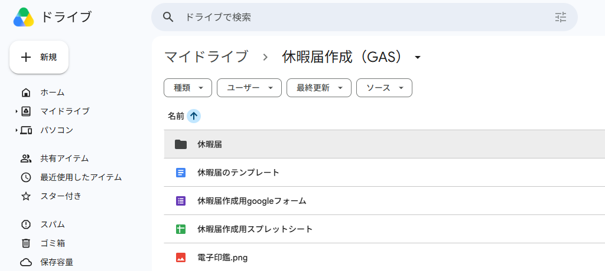

## 事前準備

### 1. Google ドライブにフォルダを作成

1. マイドライブ配下に **「休暇届作成（GAS）」** フォルダを作成
2. 「休暇届作成（GAS）」フォルダ内に **「休暇届」** フォルダを作成  
※作成したPDFは「休暇届」フォルダ内に作成されます。

### 2. 電子印鑑を作成
> ※フリーソフトの使用は自己責任でお願い致します。

1. 以下の URL にアクセス  
https://stamp.websozai.jp/index.php?color=EF454A&name=`自分の苗字`  

2. 「生成」の右側にある苗字のリンクを押下
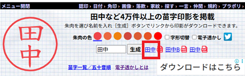  

3. 保存した画像を Google ドライブの「休暇届け作成（GAS）」フォルダ内に配置し、 **「電子印鑑.png」** にリネーム

### 3. Google フォームを作成

1. 次のフォーム URL にアクセス  
https://docs.google.com/forms/d/1mczycrHb3aEpQaFRyxp2hxeoM54DWx-nzqTZ4lk0bJ8/copy

2. 「コピーを作成」を押下
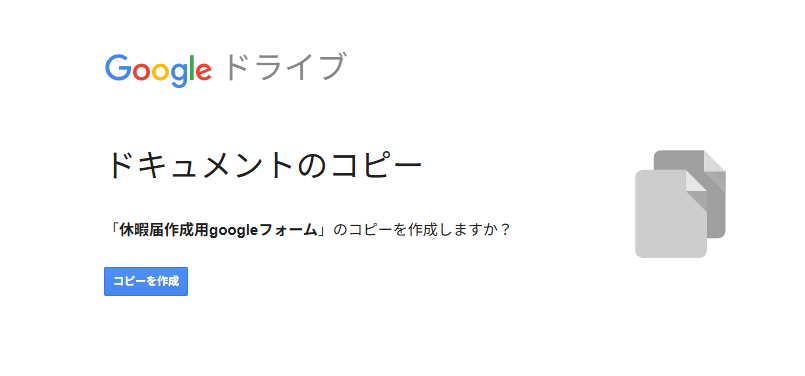

3. 「公開」を押下
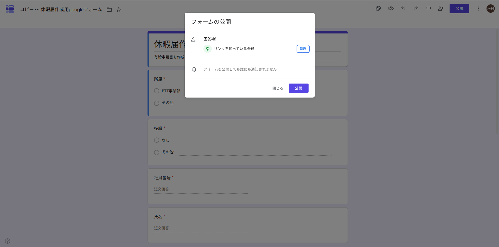

4. 「休暇申請書（GAS）」フォルダ配下に保存し、 **「休暇届作成用googleフォーム」** にリネーム

### 4. 休暇届のテンプレートを作成

1. 次のドキュメント URL にアクセス
   https://docs.google.com/document/d/1YeJ6osmTqP3RyQXiH_1d74sufUvSEuYpkg0i0Dt53OI/copy

2. 「コピーを作成」を押下
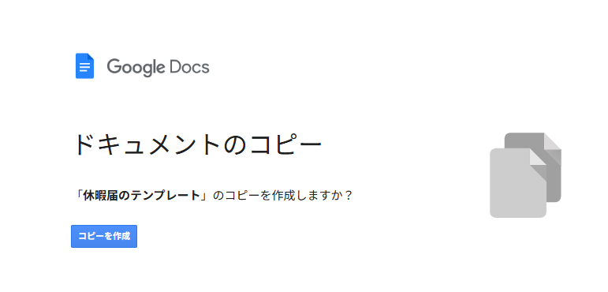
「休暇申請書（GAS）」フォルダ配下に保存し、 **「休暇届のテンプレート」** にリネーム  

### 5. チェック

1. 以下のフォルダ構成になっていればOK！
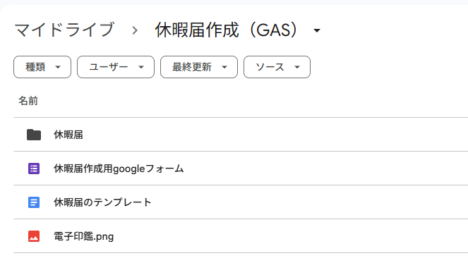

## GASスクリプト反映手順

### 1. フォームの回答スプレッドシートと Apps Script を開く

1. 「休暇届作成用Googleフォーム」を開き、「回答」タブに移動  
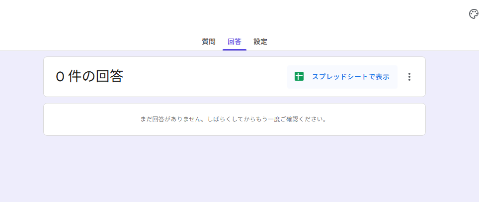

2. 「スプレッドシートで表示」をクリックして回答用のスプレッドシートを作成  
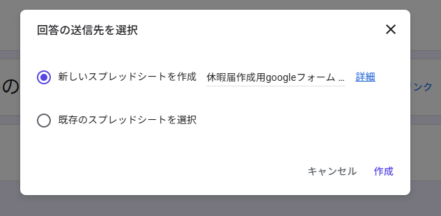

3. スプレッドシートのメニューから「拡張機能」>「Apps Script」をクリック  
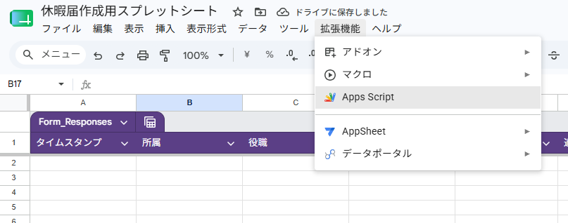

### 2. スクリプトをコピーして保存

1. GAS エディタを開く
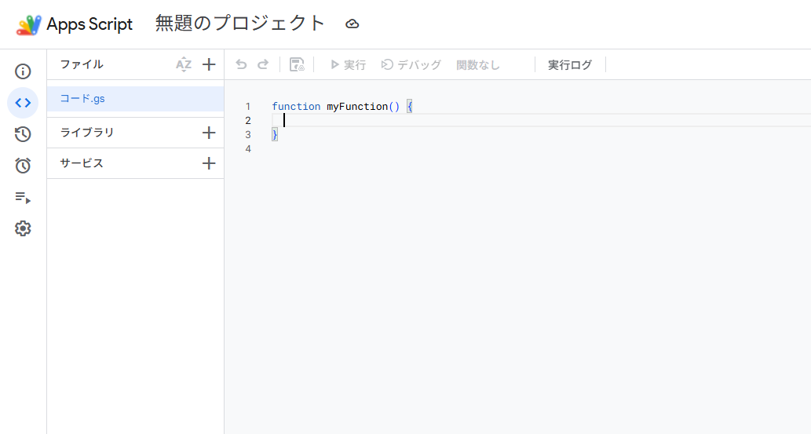

2. GitHub の以下ファイルのスクリプトを全選択しコピー  
https://github.com/ryunosuke-0305/leave-application/blob/feature/%E3%82%B3%E3%83%BC%E3%83%89.js
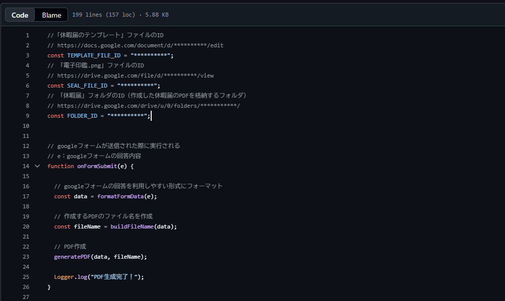  

3. `コード.gs` ファイルにペースト
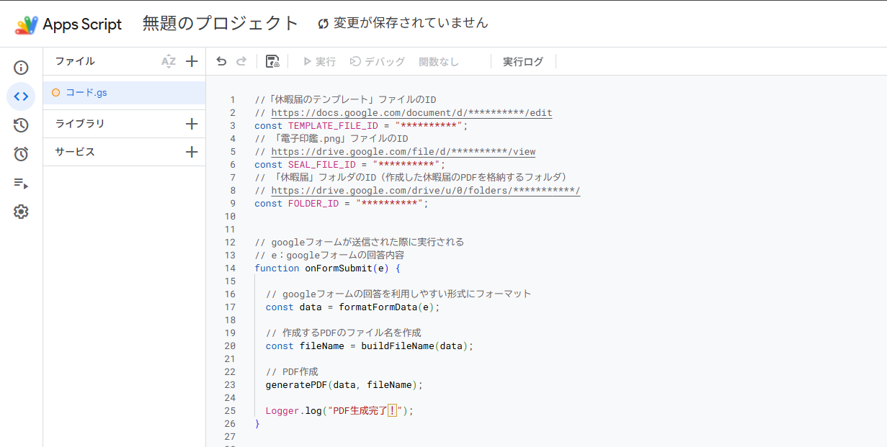

### 3. 各種ファイル ID を設定

1. 「休暇届のテンプレート」を開き、URL からファイルIDを取得  
https://docs.google.com/document/d/{ファイルID}/edit  

2. `コード.gs` ファイルにファイルIDを追記  
`const TEMPLATE_FILE_ID = "{ファイルID}"; `  

3. 「電子印鑑.png」を開き、URL からファイルIDを取得  
https://docs.google.com/document/d/{ファイルID}/edit  

4. `コード.gs` ファイルにファイルIDを追記  
`const SEAL_FILE_ID = "{ファイルID}"; `  

5. 「休暇届」フォルダを開き、URL からフォルダIDを取得  
https://drive.google.com/drive/u/0/folders/{フォルダID}/  

6. `コード.gs` ファイルにフォルダIDを追記  
`const FOLDER_ID = "{フォルダID}"; ` 

### 4. トリガーの設定

1. トリガーを選択し「トリガーを追加」を押下
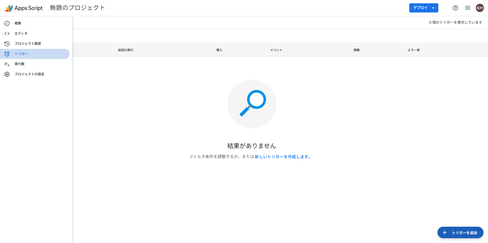

2. 以下の内容で保存  
実行する関数：onFormtSubmit  
イベントの種類を選択：フォーム送信時  
「保存」を押下
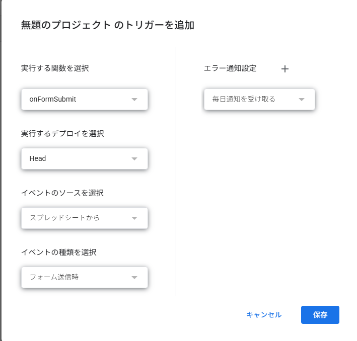

> ※以下のエラーが出る場合、内容を確認の上「advanced」からアクセスを許可して下さい。
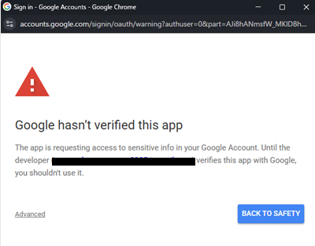

